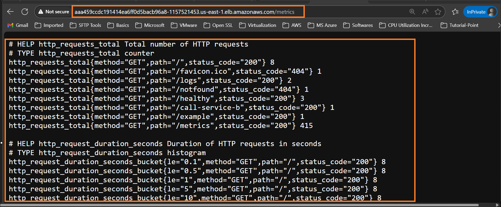
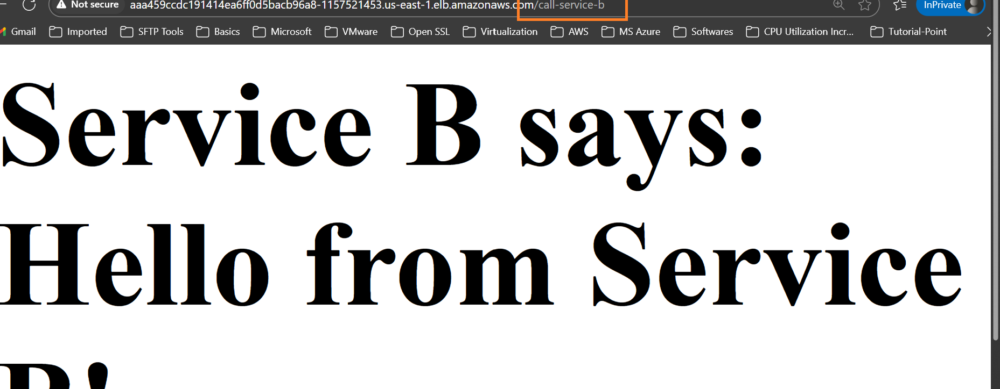
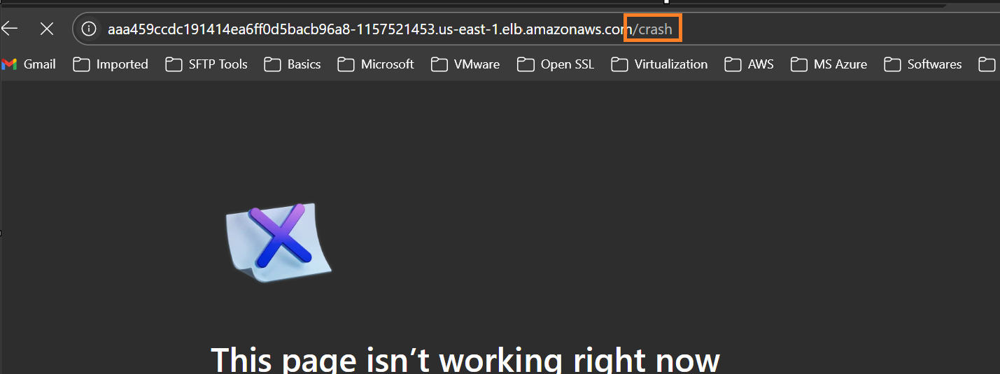
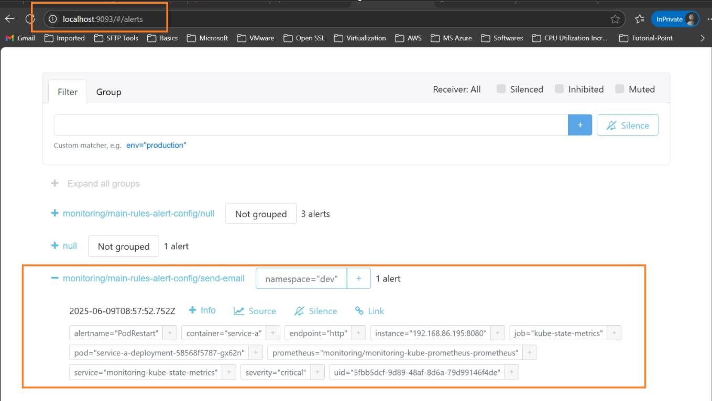
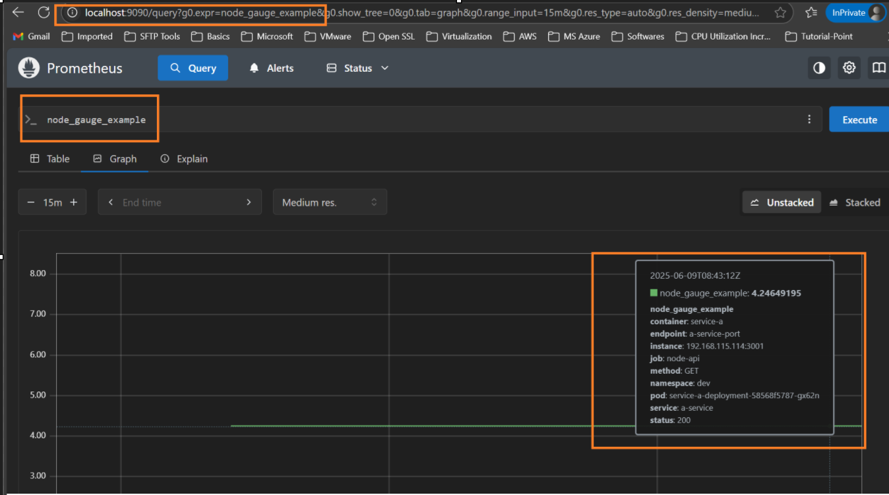
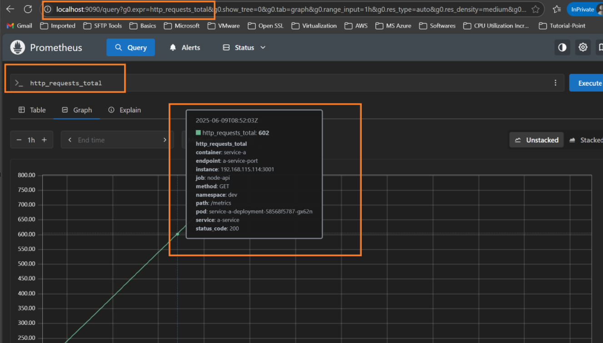
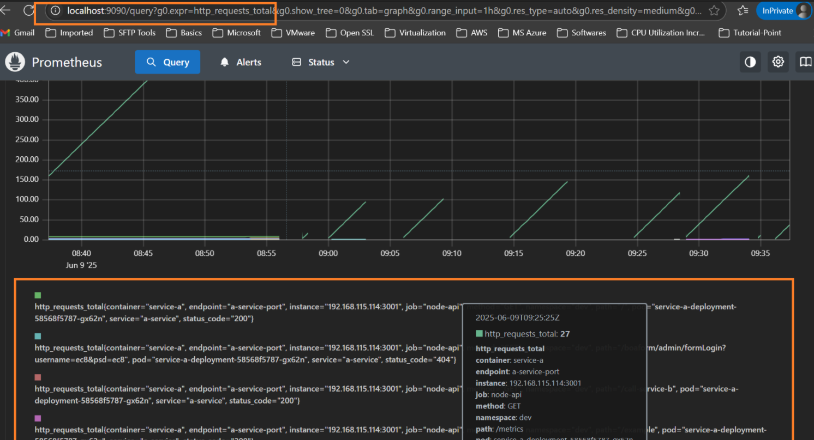
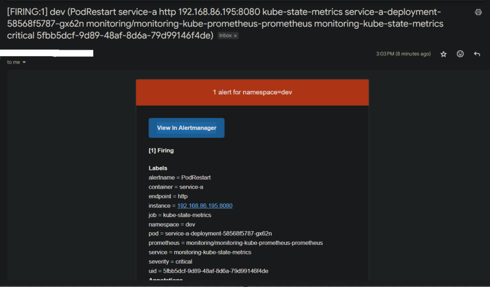

## 🎛️ Instrumentation
- Instrumentation refers to the process of adding monitoring capabilities to your applications, systems, or services.
- This involves embedding/Writting code or using tools to collect metrics, logs, or traces that provide insights into how the system is performing.

## 🎯 Purpose of Instrumentation:
- **Visibility**: It helps you gain visibility into the internal state of your applications and infrastructure.
- **Metrics Collection**: By collecting key metrics like CPU usage, memory consumption, request rates, error rates, etc., you can understand the health and performance of your system.
- **Troubleshooting**: When something goes wrong, instrumentation allows you to diagnose the issue quickly by providing detailed insights.

## ⚙️ How it Works:
- **Code-Level Instrumentation**: You can add instrumentation directly in your application code to expose metrics. For example, in a `Node.js` application, you might use a library like prom-client to expose custom metrics.

## 📈 Instrumentation in Prometheus:
- 📤 **Exporters**: Prometheus uses exporters to collect metrics from different systems. These exporters expose metrics in a format that Prometheus can scrape and store.
    - **Node Exporter**: Collects system-level metrics from Linux/Unix systems.
    - **MySQL Exporter (For MySQL Database)**:  Collects metrics from a MySQL database.
    - **PostgreSQL Exporter (For PostgreSQL Database)**: Collects metrics from a PostgreSQL database.
- 📊 **Custom Metrics**: You can instrument your application to expose custom metrics that are relevant to your specific use case. For example, you might track the number of user logins per minute.

## 📈 Types of Metrics in Prometheus
- 🔄️ **Counter**:
    - A Counter is a cumulative metric that represents a single numerical value that only ever goes up. It is used for counting events like the number of HTTP requests, errors, or tasks completed.
    - **Example**: Counting the number of times a container restarts in your Kubernetes cluster
    - **Metric Example**: `kube_pod_container_status_restarts_total`

- 📏 **Gauge**:
    - A Gauge is a metric that represents a single numerical value that can go up and down. It is typically used for things like memory usage, CPU usage, or the current number of active users.
    - **Example**: Monitoring the memory usage of a container in your Kubernetes cluster.
    - **Metric Example**: `container_memory_usage_bytes`

- 📊 **Histogram**:
    - A Histogram samples observations (usually things like request durations or response sizes) and counts them in configurable buckets.
    - It also provides a sum of all observed values and a count of observations.
    - **Example**: Measuring the response time of Kubernetes API requests in various time buckets.
    - **Metric Example**: `apiserver_request_duration_seconds_bucket`

- 📝 Summary:
    - Similar to a Histogram, a Summary samples observations and provides a total count of observations, their sum, and configurable quantiles (percentiles).
    - **Example**: Monitoring the 95th percentile of request durations to understand high latency in your Kubernetes API.
    - **Metric Example**: `apiserver_request_duration_seconds_sum`


# 🎯 Project Objectives
- 🛠️ **Implement Custom Metrics in Node.js Application**: Use the prom-client library to write and expose custom metrics in the Node.js application.
- 🚨 **Set Up Alerts in Alertmanager**: Configure Alertmanager to send email notifications if a container crashes more than two times.
- 📝 **Set Up Logging**: Implement logging on both application and cluster (node) logs for better observability using EFK stack(Elasticsearch, FluentBit, Kibana).
- 📸 **Implement Distributed Tracing for Node.js Application**: Enhance observability by instrumenting the Node.js application for distributed tracing using Jaeger. enabling better performance monitoring and troubleshooting of complex, multi-service architectures.

# 🏠 Architecture


## 1) Write Custom Metrics
- Please take a look at `day-4/application/service-a/index.js` file to learn more about custom metrics. below is the brief overview
- **Express Setup**: Initializes an Express application and sets up logging with Morgan.
- **Logging with Pino**: Defines a custom logging function using Pino for structured logging.
- **Prometheus Metrics with prom-client**: Integrates Prometheus for monitoring HTTP requests using the prom-client library:
    - `http_requests_total`: counter
    - `http_request_duration_seconds`: histogram
    - `http_request_duration_summary_seconds`: summary
    - `node_gauge_example`: gauge for tracking async task duration
### Basic Routes:
- `/` : Returns a "Running" status.
- `/healthy`: Returns the health status of the server.
- `/serverError`: Simulates a 500 Internal Server Error.
- `/notFound`: Simulates a 404 Not Found error.
- `/logs`: Generates logs using the custom logging function.
- `/crash`: Simulates a server crash by exiting the process.
- `/example`: Tracks async task duration with a gauge.
- `/metrics`: Exposes Prometheus metrics endpoint.
- `/call-service-b`: To call service b & receive data from service b

## 2) dockerize & push it to the registry
- To containerize the applications and push it to your Docker registry, run the following commands:
```bash
cd day-4

# Dockerize microservice - a
docker build -t <<NAME_OF_YOUR_REPO>>:<<TAG>> application/service-a/ 
# or use khannashiv/service-a:v1

# Dockerize microservice - b
docker build -t <<NAME_OF_YOUR_REPO>>:<<TAG>> application/service-b/ 

or use the pre-built images
- khannashiv/service-a:v1
- khannashiv/service-b:v1

```

## 3) Kubernetes manifest
- Review the Kubernetes manifest files located in `day-4/kubernetes-manifest`.
- Apply the Kubernetes manifest files to your cluster by running:
```bash
kubectl create ns dev

kubectl apply -k kubernetes-manifest/
```

## 4) Test all the endpoints
- Open a browser and get the LoadBalancer DNS name & hit the DNS name with following routes to test the application:
    - `/`
    - `/healthy`
    - `/serverError`
    - `/notFound`
    - `/logs`
    - `/example`
    - `/metrics`
    - `/call-service-b`
- Alternatively, you can run the automated script `test.sh`, which will automatically send random requests to the LoadBalancer and generate metrics:
```bash
./test.sh <<LOAD_BALANCER_DNS_NAME>>
```

## 5) Configure Alertmanager
- Review the Alertmanager configuration files located in `day-4/alerts-alertmanager-servicemonitor-manifest` but below is the brief overview
    - Before configuring Alertmanager, we need credentials to send emails. For this project, we are using Gmail, but any SMTP provider like AWS SES can be used. so please grab the credentials for that.
    - Open your Google account settings and search App password (make sure you must have 2F auth enabled on your gmail) & create a new password & put the password in `day-4/alerts-alertmanager-servicemonitor-manifest/email-secret.yml`
    - One last thing, please add your email id in the `day-4/alerts-alertmanager-servicemonitor-manifest/alertmanagerconfig.yml`
- **HighCpuUsage**: Triggers a warning alert if the average CPU usage across instances exceeds 50% for more than 5 minutes.
- **PodRestart**: Triggers a critical alert immediately if any pod restarts more than 2 times.
- Apply the manifest files to your cluster by running:
```bash
kubectl apply -k alerts-alertmanager-servicemonitor-manifest/
```
- Wait for 4-5 minutes and then check the Prometheus UI to confirm that the custom metrics implemented in the Node.js application are available:
    - `http_requests_total`: counter
    - `http_request_duration_seconds`: histogram
    - `http_request_duration_summary_seconds`: summary
    - `node_gauge_example`: gauge for tracking async task duration

## 6) Testing Alerts
- To test the alerting system, manually crash the container more than 2 times to trigger an alert (email notification).
- To crash the application container, hit the following endpoint
- `<<LOAD_BALANCER_DNS_NAME>>/crash`
- You should receive an email once the application container has restarted at least 3 times.

## Outcomes of custom metric implementation along with alertmanager.
---














---

### Some Reference Links

- [Creating a Service Monitor in Kubernetes (dev.to)](https://dev.to/apgapg/creating-a-service-monitor-in-k8s-nl8)
- [Prometheus Operator Example App Service Monitor (GitHub)](https://github.com/prometheus-operator/prometheus-operator/blob/main/example/user-guides/getting-started/example-app-service-monitor.yaml)
- [Prometheus Operator Alerting Documentation](https://prometheus-operator.dev/docs/developer/alerting/)

---