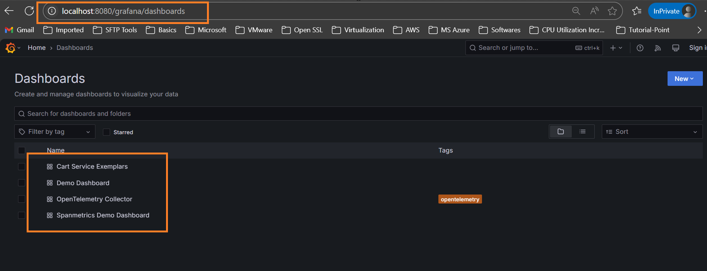

## OpenTelemtry demo for practice.

- References:
    - [OpenTelemetry Documentation](https://opentelemetry.io/docs/)
    - [OpenTelemetry Kubernetes Helm Demo](https://opentelemetry.io/docs/platforms/kubernetes/helm/demo/)
    - [OpenTelemetry Demo Architecture](https://opentelemetry.io/docs/demo/architecture/)

**Commands to run and deploy demo open telemtry application**

```bash

    # Add the OpenTelemetry Helm charts repository
    helm repo add open-telemetry https://open-telemetry.github.io/opentelemetry-helm-charts

    # Install the OpenTelemetry demo application using Helm
    helm install my-otel-demo open-telemetry/opentelemetry-demo

    # Forward local port 8080 to the frontend-proxy service in the cluster
    kubectl port-forward svc/frontend-proxy 8080:8080

```

## 🧼 Clean Up
```bash
    # Uninstall the OpenTelemetry demo application
    helm uninstall my-otel-demo

    # Delete the EKS cluster named 'observability'
    eksctl delete cluster --name observability
```

## Outcomes of OpenTelemtry demo app in the form of screenshots

---

- 
- 
- 
- 
- 
- 
- 
- 
- 

---
