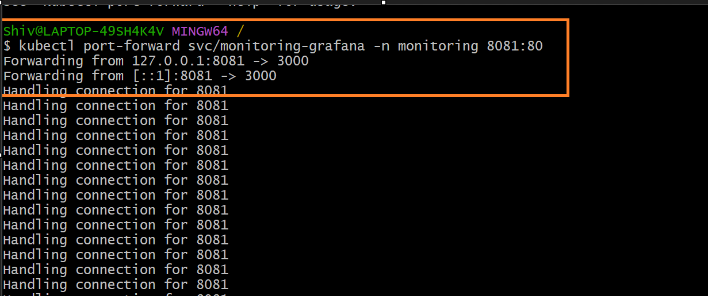

# Outcomes of Prometheus and Grafana hands-on practice & PromQL Queries for Practice.

## Refrence Documentation:
- [Scoop - Windows command-line installer](https://scoop.sh/)
- [Helm - Installation Guide](https://helm.sh/docs/intro/install/)
- [AWS EKS - Using Helm](https://docs.aws.amazon.com/eks/latest/userguide/helm.html)
- [Grafana Documentation](https://grafana.com/docs/grafana/latest/)
- [Prometheus Documentation](https://prometheus.io/docs/introduction/overview/)
- [Prometheus Metrics Documentation](https://prometheus.io/docs/concepts/metric_types/)
- [Prometheus (GitHub)](https://github.com/prometheus/prometheus/)
- [Prometheus Community Helm Charts (GitHub)](https://github.com/prometheus-community/helm-charts)
- [Prometheus Query Language (PromQL) Documentation](https://prometheus.io/docs/prometheus/latest/querying/basics/)
- [PromQL Query Examples](https://prometheus.io/docs/prometheus/latest/querying/examples/)

## For Hands-on Practice with Prometheus and Grafana

<!-- 
Please refer to the below repository for detailed instructions (includes prerequsites) on setting up Prometheus and Grafana in a Kubernetes environment, including sample dashboards and configurations. 
-->

- [Observability Zero to Hero by iam-Veeramalla](https://github.com/iam-veeramalla/observability-zero-to-hero)


## Commands used while practicing Prometheus and Grafana:
```bash
# Make sure you have eks cluster running, other prerequisites set as per the above repo 
# i.e. Observability Zero to Hero by iam-Veeramalla and kubectl configured to access it before running following commands.

# Install Scoop (Windows package manager)
Invoke-RestMethod -Uri https://get.scoop.sh | Invoke-Expression

# Set PowerShell execution policy to allow running scripts
Set-ExecutionPolicy -ExecutionPolicy RemoteSigned -Scope CurrentUser

# Install Helm (Kubernetes package manager) using Scoop
scoop install helm

# List files in the current directory (Windows)
dir

# Add the Prometheus Community Helm charts repository
helm repo add prometheus-community https://prometheus-community.github.io/helm-charts

# Update local Helm chart repository cache
helm repo update

# Create a new Kubernetes namespace called 'monitoring'
kubectl create ns monitoring

# List all pods across all namespaces
kubectl get pods -A

# Install the kube-prometheus-stack Helm chart with custom values
helm install monitoring prometheus-community/kube-prometheus-stack -n monitoring -f ./custom_kube_prometheus_stack.yml

# Get pods in the 'monitoring' namespace with label 'release=monitoring'
kubectl --namespace monitoring get pods -l "release=monitoring"

# List all pods in the 'monitoring' namespace
kubectl get pods -n monitoring

# List all services in the 'monitoring' namespace
kubectl get svc -n monitoring

# Search for charts in the prometheus-community Helm repo
helm search repo prometheus-community

# Filter search results for the kube-prometheus-stack chart
helm search repo prometheus-community | grep prometheus-community/kube-prometheus-stack

# List all Helm releases in the 'monitoring' namespace
helm list -n monitoring

# List all Helm repositories added locally
helm repo list

# Forward local port 9090 to Prometheus service in the cluster
kubectl port-forward svc/prometheus-operated -n monitoring 9090:9090

# Forward local port 9093 to Alertmanager service in the cluster
kubectl port-forward svc/alertmanager-operated -n monitoring 9093:9093

# Forward local port 8081 to Grafana service in the cluster
kubectl port-forward svc/monitoring-grafana -n monitoring 8081:80

# List all secrets in the 'monitoring' namespace
kubectl get secrets -n monitoring

# Retrieve the Grafana admin password from the secret and decode it
kubectl --namespace monitoring get secrets monitoring-grafana -o jsonpath="{.data.admin-password}" | base64 -d ; echo

# List all pods in the 'monitoring' namespace (repeated for status checks)
kubectl get pods -n monitoring

# List all services in the 'monitoring' namespace (repeated for status checks)
kubectl get svc -n monitoring

# Deploy a faulty pod to test monitoring and alerting
kubectl apply -f faulty-pod.yaml

# List all pods in the 'default' namespace
kubectl get pods -n default

# Export the YAML definition of the 'opensearch-0' pod in the 'default' namespace
kubectl get pod opensearch-0 -n default -o yaml > demo.yaml

# PromQL query to get restarts for the 'nginx' pod (for use in Prometheus/Grafana)
kube_pod_container_status_restarts_total{pod="nginx"}

# Cleanup Commands.

# Uninstall the 'monitoring' Helm release from the 'monitoring' namespace
helm uninstall monitoring --namespace monitoring

# Delete the 'monitoring' namespace and all resources within it from the Kubernetes cluster
kubectl delete ns monitoring

# Delete the entire EKS (Elastic Kubernetes Service) cluster named 'observability'
eksctl delete cluster --name observability

```

Prometheus and Grafana are powerful tools for monitoring and visualizing metrics in a Kubernetes environment. Below are some common PromQL queries that can be used to extract useful metrics from Prometheus, along with explanations of what each query does.
# Some common PromQL queries for practice.

## 1. Basic Metric Query
```promql
up
```
*Shows if targets are up (1) or down (0).*

---

## 2. CPU Usage (Node Exporter)
```promql
100 - (avg by(instance) (irate(node_cpu_seconds_total{mode="idle"}[5m])) * 100)
```
*CPU usage percentage per instance.*

---

## 3. Memory Usage (Node Exporter)
```promql
node_memory_MemTotal_bytes - node_memory_MemAvailable_bytes
```
*Total used memory in bytes.*

---

## 4. HTTP Request Rate (per second)
```promql
sum(rate(http_requests_total[1m]))
```
*Total HTTP requests per second.*

---

## 5. Error Rate (HTTP 5xx)
```promql
sum(rate(http_requests_total{status=~"5.."}[5m]))
```
*HTTP 5xx error rate.*

---

## 6. Top 5 High CPU Usage Instances
```promql
topk(5, 100 - (avg by(instance) (irate(node_cpu_seconds_total{mode="idle"}[5m])) * 100))
```
*Top 5 instances by CPU usage.*

---

## 7. Disk Space Usage Percentage
```promql
(node_filesystem_size_bytes{mountpoint="/"} - node_filesystem_free_bytes{mountpoint="/"}) 
/ node_filesystem_size_bytes{mountpoint="/"} * 100
```
*Disk usage percentage for root mount.*

---

## 8. Pod Restarts (Kubernetes)
```promql
sum(increase(kube_pod_container_status_restarts_total[1h])) by (pod)
```
*Pod restarts in the last hour.*

---

## 9. Average Latency (Histogram)
```promql
rate(http_request_duration_seconds_sum[5m]) / rate(http_request_duration_seconds_count[5m])
```
*Average HTTP request latency.*

---

## 10. Alert: High CPU Usage (>80%)
```promql
100 - (avg by(instance) (irate(node_cpu_seconds_total{mode="idle"}[5m])) * 100) > 80
```
*Instances with CPU usage above 80%.*

---

## 11. Pod Restarts for a Specific Pod

```promql  
    kube_pod_container_status_restarts_total{pod="nginx"}
```
*Total restarts for the `nginx` pod.*

---

## **Outcomes of Prometheus and Grafana hands-on practice**
- Successfully set up Prometheus and Grafana in a Kubernetes cluster using Helm.
- Created sample / custom dashboards in Grafana to visualize metrics.

- 
- 

- 
- 
- 
- 
- 
- 
- 
- 
- 
- 
- 

- 
- 
- 
- 
- 
- 
- 
- 
- 

- 
- 
- 
- 
- 
- 
- 
- 
- 
- 
- 

- 

---
